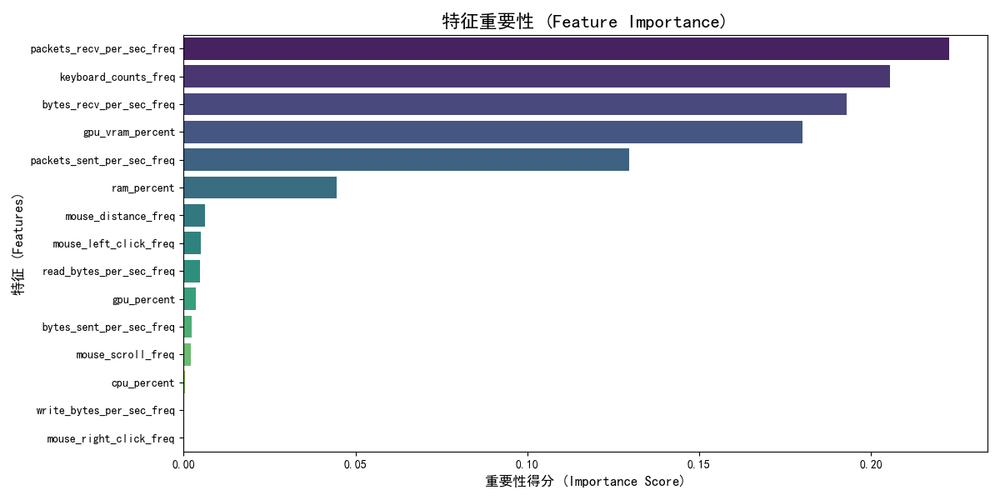

#  Digit_Spirit

2025年HITSZ创芯杯项目上位机部分，使用xgboost判断用户状态，配合下位机实现更舒适的精神互动。

:warning:由于数据采集有限，因此模型聚焦于更纯净的典型场景，分别为`coding`、`video`、`gaming`、`idle`，对于更混沌的场景并未涉猎。

## 运行逻辑

## 模型表现

## 文件概述

* `model_test_ui/model_test.py`：exe的源文件
* `model_train.ipynb`：训练源文件
* `data_processs.py`：数据处理文件
* `ui_test.py`：数据采集文件